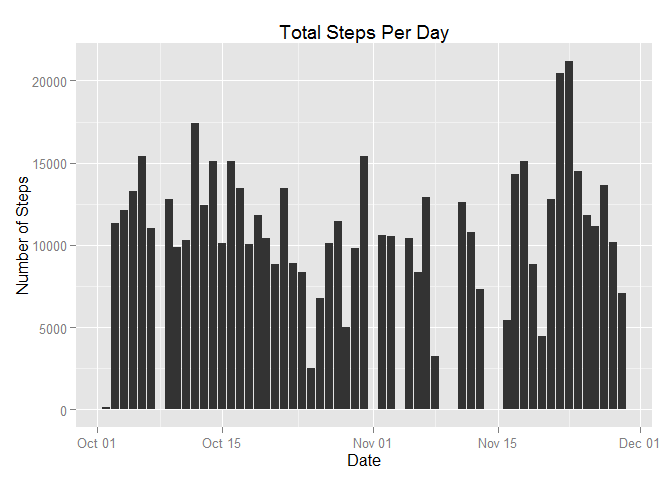
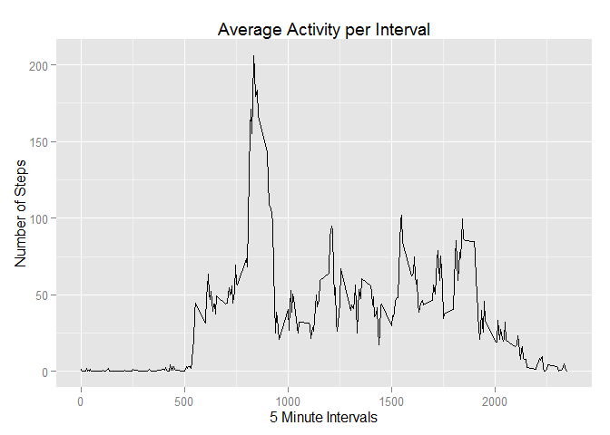
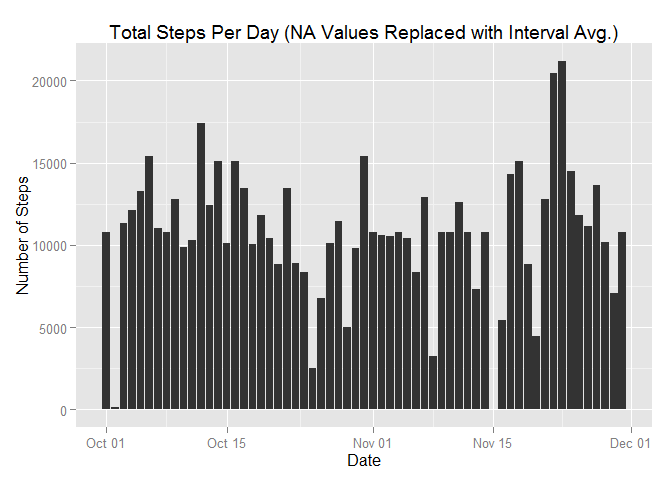
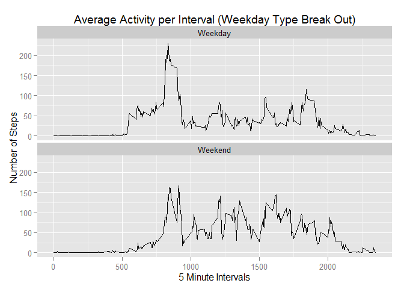

# Reproducible Research: Peer Assessment 1
Travis M. Allen  
Saturday, August 15, 2015  

## Loads required packages, installing them if necessary
The following packages are loaded:  
 * data.table  
 * dplyr  
 * ggplot2  
 * xtable  


```r
if("data.table" %in% rownames(installed.packages()) == FALSE) {install.packages("data.table")}
if("dplyr" %in% rownames(installed.packages()) == FALSE) {install.packages("dplyr")}
if("ggplot2" %in% rownames(installed.packages()) == FALSE) {install.packages("ggplot2")}
if("xtable" %in% rownames(installed.packages()) == FALSE) {install.packages("xtable")}

library(dplyr)
```

```
## 
## Attaching package: 'dplyr'
## 
## The following object is masked from 'package:stats':
## 
##     filter
## 
## The following objects are masked from 'package:base':
## 
##     intersect, setdiff, setequal, union
```

```r
library(ggplot2)
library(xtable)
library(data.table)
```

```
## 
## Attaching package: 'data.table'
## 
## The following objects are masked from 'package:dplyr':
## 
##     between, last
```

## Loading and preprocessing the data

```r
dt_act <- fread("activity.csv")
```

## What is mean total number of steps taken per day?

The total number of steps per day are calulated and stored in **step_sum**


```r
step_sum <- dt_act %>% 
            select(date, steps) %>% 
            filter(complete.cases(.)) %>% 
            mutate(formatted_date = as.Date(date, format = '%Y-%m-%d')) %>%
            select(formatted_date, steps) %>%
            arrange(formatted_date, steps) %>% 
            group_by (formatted_date) %>%
            summarise(total_steps = sum(steps, na.rm = TRUE))
```

Below is a histogram of the number of steps taken per day.


```r
ggplot(step_sum, aes(x = formatted_date, y = total_steps)) + 
geom_histogram(stat="identity") +
ggtitle("Total Steps Per Day") +
labs(x="Date",y="Number of Steps")
```

 

Below are the calculations for the mean and median steps.


```r
mean_of_steps <- mean(step_sum$total_steps)
median_of_steps <- median(step_sum$total_steps)
```

Mean: *1.0766189\times 10^{4}*  
Median: *10765*  

## What is the average daily activity pattern?

Below is the calculation for the average number of steps taken, averaged across all days.


```r
interval_avg <- dt_act %>%
               filter(complete.cases(.)) %>% 
               select(interval, steps) %>%
               arrange(interval, steps) %>% 
               group_by (interval) %>%
               summarise(avg_steps = mean(steps))
```

Below is a time series plot of the 5-minute interval and the average number of steps taken, averaged across all days.  


```r
ggplot(interval_avg, aes(x = interval, y = avg_steps)) + 
geom_line() +
ggtitle("Average Activity per Interval") +
labs(x="5 Minute Intervals",y="Number of Steps")
```

 

Below is the calculation to identify the interval with the maximum average number of steps.


```r
max_avg_interval <- interval_avg %>%
                    filter(avg_steps == max(interval_avg$avg_steps))
```

Max. Avg. Interval: *835*  

## Imputing missing values

Below is the calculation for number of missing values in the dataset.


```r
number_of_na <- sum(is.na(dt_act))
```

Number of Missing Values: *2304*  
  
The following code replaces **NA** values with the average value for the interval.


```r
act_no_na <- dt_act
act_no_na <- merge(act_no_na, interval_avg, by = "interval")
act_no_na <- within(act_no_na, steps[is.na(steps)] <- avg_steps[is.na(steps)])

no_na_step_sum <- act_no_na %>% 
            select(date, steps) %>% 
            filter(complete.cases(.)) %>% 
            mutate(formatted_date = as.Date(date, format = '%Y-%m-%d')) %>%
            select(formatted_date, steps) %>%
            arrange(formatted_date, steps) %>% 
            group_by (formatted_date) %>%
            summarise(total_steps = sum(steps, na.rm = TRUE))
```

Below is a histogram of the number of steps taken per day after replacing the **NA** values.  

Replacing  **NA** values creates a histogram that presents a visualization of more consistent activity day over day.


```r
ggplot(no_na_step_sum, aes(x = formatted_date, y = total_steps)) + 
geom_histogram(stat="identity") +
ggtitle("Total Steps Per Day (NA Values Replaced with Interval Avg.)") +
labs(x="Date",y="Number of Steps")
```

 

Below are the calculations for the mean and median steps.


```r
no_na_mean_of_steps <- mean(step_sum$total_steps)
no_na_median_of_steps <- median(step_sum$total_steps)
```

Mean: *1.0766189\times 10^{4}*  
Median: *10765*  
  
## Are there differences in activity patterns between weekdays and weekends?

The code below identifies weekend and weekday, and creates a factor **day_type** to categorize the observation.  


```r
no_na_interval_avg <- act_no_na %>%
                mutate(formatted_date = as.Date(date, format = '%Y-%m-%d')) %>%
                mutate(day_type = ifelse(weekdays(formatted_date) == "Saturday" | weekdays(formatted_date) == "Sunday","Weekend","Weekday")) %>%
                arrange(interval, steps) %>% 
                group_by (day_type, interval) %>%
                summarise(avg_steps = mean(steps))

no_na_interval_avg$day_type <- as.factor(no_na_interval_avg$day_type)
```

Below are time series plots for weekday and weekends,highlighting the differece
between their averaged activity across all days.  


```r
ggplot(no_na_interval_avg, aes(x = interval, y = avg_steps)) + 
geom_line() +
facet_wrap(~day_type, ncol=1) +
ggtitle("Average Activity per Interval (Weekday Type Break Out)") +
labs(x="5 Minute Intervals",y="Number of Steps")
```

 
